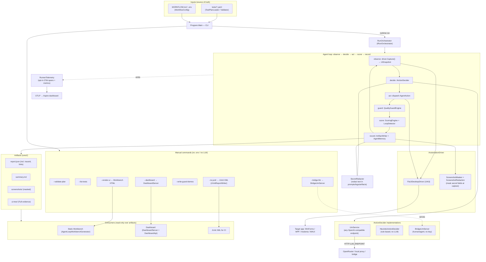

# Architecture Diagram

A complete map of the components and how data flows. (Renders on GitHub via Mermaid.)
Naming note: the loop is **AgentLoop** (decision D3). The code symbols were renamed off the
legacy `Symphony*` name; the only retained `symphony` token is the generated `docs/symphony.html`
artifact (a possibly-published Pages URL) and the deliberate "Symphony ticket" model name. All
of it is **our own** code, unrelated to `openai/symphony` (a coding-agent orchestrator).

## End-to-end flow

## Function inventory (by file)

| File | Key functions / responsibility |
|---|---|
| `Program.cs` | `Main` (CLI parse + dispatch), `RunDashboard`, `RunBridgeLlm`, `ToJUnit`, `ValidatePlans`, `ListTests`, `WriteGuardDemos` |
| `RunOrchestrator.cs` | `RunAsync` (run-level span + metrics), `RunCoreAsync` (the loop), `IsActionAllowed` |
| `IActionDecider.cs` | `DecideActionAsync` — the decide seam |
| `LlmService.cs` | `DecideActionAsync` → PromptBuilder + OpenAI client + LlmResponseParser |
| `HeuristicActionDecider.cs` | `DecideActionAsync` — fill inputs / click sequence / Done |
| `BridgeLlmServer.cs` | `Start`/`Handle`/`WaitForReply`/`ExtractPrompt` — file-based decider endpoint |
| `FlaUiDesktopDriver.cs` | `AttachToWindow`, `Capture`, `GetAllElements`, `EnterText`, `Click`, `Scroll`, `DoubleClick`, `ReadText`, `CaptureScreenshot` |
| `ScreenshotMasker.cs` / `ScreenshotRedaction.cs` | `MaskRegions` / `SecretRegions` |
| `SecretRedactor.cs` | `IsSensitiveIdentifier`, `RedactText`, `RedactActionValue`, `RedactSnapshot` |
| `ScoringEngine.cs` / `LoopDetector.cs` / `QualityGuards.cs` | `ScoreAction`/`ShouldAbort`; `RecordAndCheck`; `Check` |
| `AgentMemory.cs` | `RecordScreen`, `AddAction`, `AddFact`, `GetFullContextString` |
| `ArtifactWriter.cs` / `RunArtifactLoader.cs` | `WriteReport`/`WriteSummary`/`SaveScreenshot`/`SaveUiTreeSnapshot`; `LoadFromDirectory` |
| `JUnitReportWriter.cs` | `Write`, `ToTestCase`, `BuildProperties` (existing_test/source_*/trace_id) |
| `RunnerTelemetry.cs` | `Source`/`Meter` instruments, `TryStartExport` (OTLP HttpProtobuf) |
| `AgentLoopWorkbenchGenerator.cs` | `Generate`, `RenderHtml`, `BuildDataIsland`, `InteractiveScript`, `LoadTests`, `LoadRuns` |
| `Dashboard/DashboardServer.cs` | `Start`, `Route`, `Handle` (localhost HTTP) |
| `Dashboard/DashboardApi.cs` | `GetTests`, `GetRuns`, `GetRun`, `GetJobs`, `CreateTest`, `LaunchRun`, `GetScreenshot(List)`, `GetFiles`, `GetFile`, `ResolveUnderRoot` |
| `Dashboard/RunJobManager.cs` | `Launch`, `Snapshot`, runId correlation |
| `TestPlanLoader.cs` / `TestPlanValidator.cs` | `DiscoverPlanPaths`, `Load`, `Parse`; `Validate` |

Everything above is original to this repo and operates on its own models (`RunArtifact`,
`UiSnapshot`, `AgentAction`, `AgentGoal`) and FlaUI/UIA.
