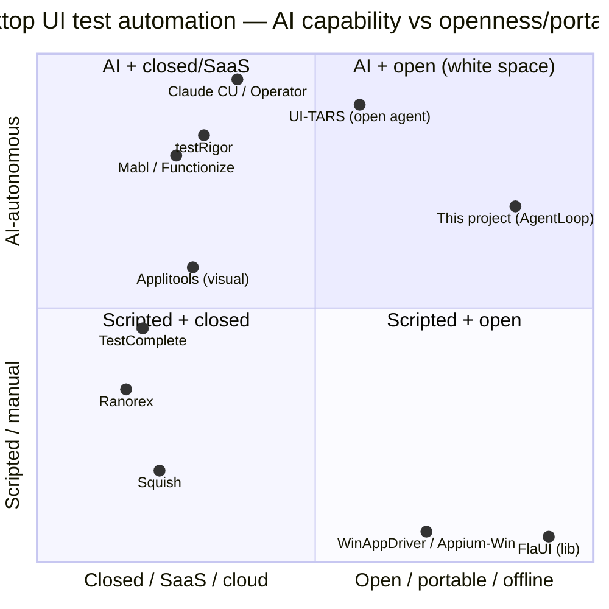

# Competitive Analysis & Strategy

*Snapshot 2026-06. Opinionated. Pair with `docs/roadmap.md` (the what) — this is the
why-it-matters-vs-the-market.*

## TL;DR verdict

This project sits in a **near-empty intersection**: *AI-agent-driven* × *Windows-native
desktop .NET* × *portable / offline / no-SaaS* × *non-intrusive* × *legacy .NET Framework 4.8*.
The AI-testing wave is overwhelmingly **web/mobile SaaS**; desktop automation is either
**abandoned** (WinAppDriver, TestStack.White), **expensive closed commercial**
(Ranorex, TestComplete), or **just a library** (FlaUI). General computer-use agents
(Claude Computer Use, OpenAI Operator, UI-TARS) are **non-deterministic, cloud, per-step-cost,
and have no QA contract**.

So the positioning is defensible: **"the open, portable, AI-*optional* test agent for .NET
desktop — including legacy Framework 4.8 — that runs offline in your own CI with no per-run AI
cost and no SaaS."** The architecture is unusually disciplined for an early project (clean
seams, deterministic guards/scoring, redaction, OpenTelemetry, JUnit, non-intrusive).

**But** the value proposition hinges on two not-yet-built things: **vision fallback (V3)** for
real-world apps whose UIA tree is flat/owner-drawn, and **adoption ergonomics** (recording V9.5
+ self-healing V8). Without V3 it's *"FlaUI with a nicer YAML/agent wrapper"*; with V3 it
becomes *"handles the apps FlaUI/UIA alone can't."* That is the make-or-break line.

## Positioning map

> Caveat: several AI-QA SaaS tools (testRigor, Mabl, Functionize, Applitools) are **web/mobile
> first**; their desktop story is thin or absent. They are plotted by category, not by desktop
> coverage. The desktop-relevant competitors are really FlaUI (below), Ranorex/TestComplete
> (left), and general computer-use agents (top) — and this project is alone in the top-right.

## Capability matrix (desktop lens)

| | This project | FlaUI | WinAppDriver/Appium | Ranorex | TestComplete | testRigor/Mabl (SaaS) | Claude CU / Operator |
|---|---|---|---|---|---|---|---|
| Windows desktop native | ✅ | ✅ | ✅ | ✅ | ✅ | ⚠️ thin | ✅ (vision) |
| WinForms/WPF/Avalonia/MAUI | ✅ (MAUI E2E pending) | ✅ (lib) | ⚠️ | ✅ | ✅ | ❌ | ✅ |
| **.NET Framework 4.8 legacy** | ✅ | ✅ | ✅ | ✅ | ✅ | ❌ | ✅ |
| AI-authored / AI-driven | ✅ (optional) | ❌ | ❌ | ⚠️ recog. | ⚠️ visual+heal | ✅ | ✅ |
| **Works offline / air-gapped** | ✅ | ✅ | ✅ | ✅ | ✅ | ❌ | ❌ |
| **Zero per-run AI cost** (heuristic/bridge) | ✅ | ✅ | ✅ | ✅ | ✅ | ❌ $/run | ❌ $/step |
| Deterministic guards + scoring | ✅ | ❌ | ❌ | ⚠️ | ⚠️ | ⚠️ | ❌ |
| Portable contract (CLI/YAML/artifacts) | ✅ | ❌ (code) | ⚠️ (proto) | ❌ (IDE) | ❌ (IDE) | ❌ (SaaS) | ❌ |
| Vision fallback (flat UIA) | 🔜 V3 | ❌ | ❌ | ⚠️ | ✅ | ✅ | ✅ |
| Self-healing selectors | 🔜 V8 | ❌ | ❌ | ⚠️ | ✅ | ✅ | n/a |
| Record → test draft | 🔜 V9.5 | ❌ | ❌ | ✅ | ✅ | ✅ | n/a |
| Secret redaction (logs+screenshots) | ✅ | ❌ | ❌ | ⚠️ | ⚠️ | ⚠️ | ❌ |
| Non-intrusive (no SUT changes) | ✅ | ✅ | ✅ | ✅ | ✅ | ✅ | ✅ |
| Price / lock-in | open / none | open | open | €€€ seat | €€€ seat | $$ sub | $ tokens |
| Maturity / control breadth | early | mature lib | stale | very mature | very mature | mature (web) | mature (general) |

✅ yes · ⚠️ partial/weak · ❌ no · 🔜 planned

## Where we win (the wedge)

1. **Desktop + open + AI is white space.** The AI-QA gold rush went to the browser. Desktop
   buyers get dead tools, pricey IDEs, or a raw library. Nobody offers an open, agentic,
   portable desktop runner.
2. **AI-*optional*, not AI-dependent.** Heuristic decider + the file-IO bridge mean a full CI
   pipeline runs with **no key and no cost**, and an LLM is a pure accelerator. SaaS AI-QA bills
   per run and needs the cloud; computer-use agents burn tokens per step and are
   non-deterministic. This is a genuinely different cost/trust curve.
3. **Legacy .NET Framework 4.8.** A massive enterprise install base that the SaaS/web crowd
   ignores entirely. Combined with WinForms/WPF, this is the conservative-enterprise long tail.
4. **Offline / air-gapped / data-never-leaves.** Banks, defense, health, industrial — exactly
   the desktop-heavy verticals — can't send screenshots of their app to a SaaS. We run in their
   own CI.
5. **2026-native: agents author the tests.** The CLI+YAML+schema+bridge contract is built so
   Claude Code / Copilot *write and run* the tests. Incumbents would have to rebuild around an
   open CLI to copy this.
6. **QA-grade rigor vs. hype.** Deterministic guards, scoring, redaction, UIA-first (vision as
   fallback), JUnit, OTel traces — the things pure vision agents lack.

## Where we're exposed (be honest)

- **Vision gap (V3) is the #1 risk.** Until UIA+VLM fallback exists, hit-rate is capped by the
  target app's accessibility quality. Owner-drawn/custom controls (common in Avalonia/MAUI,
  Citrix/RDP, legacy GDI, Electron-in-desktop) will defeat a pure-UIA agent — and that's a large
  slice of real desktop apps. TestComplete and computer-use agents already handle these.
- **Adoption ergonomics.** No recording mode (V9.5) and no self-healing (V8) yet — both are
  table-stakes for non-coder adoption and are the headline AI-QA selling points.
- **Maturity / breadth / bus factor.** Ranorex & TestComplete have 10+ years of control
  support, IDEs, reporting, and support contracts. This is early, single-maintainer,
  samples-only proof, MAUI E2E unproven.
- **"Just script FlaUI" objection.** If the AI path isn't visibly better than hand-written
  FlaUI, the wedge collapses. The agent/decider quality must earn its place.
- **Distribution / trust.** No brand, no case study on a real app, no `dotnet tool` one-liner,
  no marketplace presence. Conservative desktop buyers need a proof bridge.
- **TAM ceiling (deliberate).** Windows-desktop-only by design. Fine as focus, but caps reach
  vs. full-stack suites.

## Strategy & plan

Sequenced by *what unlocks the next dollar of credibility*, not by version number.

### P0 — Earn the moat (without this it's "FlaUI + YAML")
- **V3 Tier-2 vision fallback.** UIA-first; when the tree is flat/ambiguous, render the
  screenshot with numbered bounding boxes and let a VLM disambiguate → action. The
  redact-at-capture masking already shipped is a primitive toward this. *This is the single
  highest-leverage feature in the whole roadmap.*
- **Prove runtime cross-framework, incl. MAUI E2E.** Close the "samples-only" credibility gap;
  MAUI/Avalonia custom controls are exactly where vision pays off. Re-run the gated UI E2E on a
  clean interactive box.

### P1 — Adoption ergonomics (beat "free FlaUI" friction; court non-coders)
- **V9.5 Recording mode.** Manual session → first YAML draft (editable, validated). Biggest
  top-of-funnel lever; table-stakes vs Ranorex/TestComplete/testRigor.
- **V8 Controlled self-healing.** Selector drift → semantic/vision suggestion *with evidence*
  (old/new selector, screenshot, confidence). CI never auto-edits; local applies only with an
  explicit flag. The marquee AI-QA feature, done the trustworthy way.
- **Lean into agent-authored tests as GTM.** Ship an **MCP adapter** over the CLI so Claude
  Desktop / Copilot / agents drive listing, authoring, validation, and runs natively. Cheap,
  on-brand (adapter, not core), and highly visible in the 2026 agent ecosystem.

### P2 — Proof, trust, distribution
- **Reference proof on a real legacy LOB app** (ideally .NET Framework 4.8), not just samples.
  One credible case study is worth ten features here.
- **One-line install + signed release + GitHub Pages live demo** (`dotnet tool install -g`).
  Lower the bar from "clone a repo" to "run a command."
- **V11 analytics from run history** — flaky tests, selector-drift, cost/duration per test,
  framework reliability. Differentiates from a bare runner; the portable artifacts already
  carry the data.

### P3 — Optional / demand-pulled
- Cross-platform via Appium (MAUI Android/iOS/Mac) **only if pulled by users** — keep the
  Windows focus that makes the product legible.
- Keep deferring: SaaS cockpit, auth/multi-tenant, VM provisioning, multi-agent chat. They'd
  dilute the portable-first promise that *is* the differentiation.

### The one-sentence bet
> If V3 (vision fallback) + V9.5 (recording) land while staying portable/offline/AI-optional,
> this becomes the default open choice for .NET-desktop teams who can't or won't send their app
> to a SaaS — a niche with no real incumbent. If they don't, it stays a tidy FlaUI wrapper.
